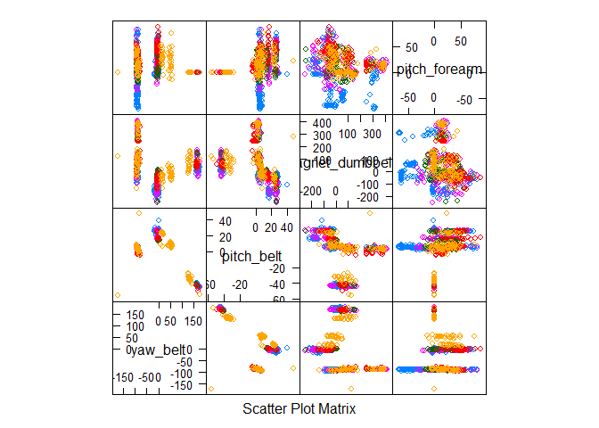

# Practical Machine Learning Prediction Project
Wayne Springle  
June 3, 2016  


## Background

Using devices such as Jawbone Up, Nike FuelBand, and Fitbit it is now possible to collect a large amount of data about personal activity relatively inexpensively. These type of devices are part of the quantified self movement - a group of enthusiasts who take measurements about themselves regularly to improve their health, to find patterns in their behavior, or because they are tech geeks. One thing that people regularly do is quantify how much of a particular activity they do, but they rarely quantify how well they do it. In this project, your goal will be to use data from accelerometers on the belt, forearm, arm, and dumbell of 6 participants. They were asked to perform barbell lifts correctly and incorrectly in 5 different ways. More information is available from the website here: http://groupware.les.inf.puc-rio.br/har (see the section on the Weight Lifting Exercise Dataset).

## Data

The training data for this project are available here:

(https://d396qusza40orc.cloudfront.net/predmachlearn/pml-training.csv)

The test data are available here:

(https://d396qusza40orc.cloudfront.net/predmachlearn/pml-testing.csv)


The data for this project come from this source: (http://groupware.les.inf.puc-rio.br/har). If you use the document you create for this class for any purpose please cite them as they have been very generous in allowing their data to be used for this kind of assignment.

## Goal

The goal of the project is to predict the manner in which they did the exercise. This is the "classe" variable in the training set. You may use any of the other variables to predict with. You should create a report describing how you built your model, how you used cross validation, what you think the expected out of sample error is, and why you made the choices you did. You will also use your prediction model to predict 20 different test cases.

## Loading the necessary packages for exploring the dataset


```r
library(caret)
```

```
## Loading required package: lattice
```

```
## Loading required package: ggplot2
```

```r
library(rpart)
library(rpart.plot)
library(RColorBrewer)
library(rattle)
```

```
## Rattle: A free graphical interface for data mining with R.
## Version 4.1.0 Copyright (c) 2006-2015 Togaware Pty Ltd.
## Type 'rattle()' to shake, rattle, and roll your data.
```

```r
library(randomForest)
```

```
## randomForest 4.6-12
```

```
## Type rfNews() to see new features/changes/bug fixes.
```

```
## 
## Attaching package: 'randomForest'
```

```
## The following object is masked from 'package:ggplot2':
## 
##     margin
```

```r
library(knitr)
```

## Getting and loading the data


```r
library(caret)
if (!file.exists("pml-training.csv")) {
  download.file("http://d396qusza40orc.cloudfront.net/predmachlearn/pml-training.csv", destfile = "pml-training.csv")
}
if (!file.exists("pml-testing.csv")) {
  download.file("http://d396qusza40orc.cloudfront.net/predmachlearn/pml-testing.csv", destfile = "pml-testing.csv")
}
MyData <- read.csv("pml-testing.csv", sep = ",", na.strings = c("", "NA"))
data <- read.csv("pml-training.csv", sep = ",", na.strings = c("", "NA"))
```

## Cleaning the data
Here, I remove columns full of NAs and remove features that are not in the MyData set. The features containing NAs are the variance, mean and stddev within each window for each feature. Since the MyData dataset has no time-dependence, these values are useless and can be disregarded. I also remove the first 7 features since they are related to the time-series or are not numeric.


```r
# Remove columns full of NAs.
features <- names(MyData[,colSums(is.na(MyData)) == 0])[8:59]
# Only use features used in MyData cases.
data.1 <- data[,c(features,"classe")]
MyData.1 <- MyData[,c(features,"problem_id")]
dim(data.1)
```

```
## [1] 19622    53
```

```r
dim(MyData.1)
```

```
## [1] 20 53
```

## Bootstrap
After the final model is constructed, I withhold 25% of the dataset for testing.


```r
library(caret)
set.seed(234)
inTrain <- createDataPartition(data$classe, p = 0.75, list = F)
training <- data.1[inTrain,]
testing <- data.1[-inTrain,]
dim(training)
```

```
## [1] 14718    53
```

```r
dim(testing)
```

```
## [1] 4904   53
```

## Feature Selection
Some features may be highly correlated. The PCA method mixes the final features into components that are difficult to interpret; instead, I drop features with high correlation (>90%).


```r
outcome <- which(names(training) == "classe")
highCorrCols <- findCorrelation(abs(cor(training[,-outcome])),0.90)
highCorrFeatures <- names(training)[highCorrCols]
training <- training[,-highCorrCols]
outcome <- which(names(training) == "classe")
```
The features with high correlation are accel_belt_z, roll_belt, accel_belt_y, accel_belt_x, gyros_arm_y, gyros_forearm_z, and gyros_dumbbell_x.

## Feature Importance
The random forest method reduces overfitting and is good for nonlinear features. First, to see if the data is nonlinear, I use the random forest to discover the most important features. The feature plot for the 4 most important features is shown.


```r
library(rpart)
library(rpart.plot)
library(randomForest)
fsRF <- randomForest(training[,-outcome], training[,outcome], importance = T)
rfImp <- data.frame(fsRF$importance)
impFeatures <- order(-rfImp$MeanDecreaseGini)
inImp <- createDataPartition(data.1$classe, p = 0.05, list = F)
featurePlot(training[inImp,impFeatures[1:4]],training$classe[inImp], plot = "pairs")
```

<!-- -->

The most important features are:

pitch_belt

yaw_belt

total_accel_belt

gyros_belt_x

## Training
In training, the random forest and K-nearest neighbors are used for comparison.


```r
ctrlKNN <- trainControl(method = "adaptive_cv")
modelKNN <- train(classe ~ ., training, method = "knn", trControl = ctrlKNN)
ctrlRF <- trainControl(method = "oob")
modelRF <- train(classe ~ ., training, method = "rf", ntree = 200, trControl = ctrlRF)
resultsKNN <- data.frame(modelKNN$results)
resultsRF <- data.frame(modelRF$results)
```
## Testing Out-of-sample error
The random forest will give a larger accuracy compared to k-nearest neighbors. Here, I give the confusion matrix between the KNN and RF models to see how much they agree on the test set, then I compare each model using the test set outcomes.


```r
# Fit the models to the test dataset and compare fit
fitKNN = predict(modelKNN, testing)
fitRF = predict(modelRF, testing)
confusionMatrix(fitKNN, fitRF)
```

```
## Confusion Matrix and Statistics
## 
##           Reference
## Prediction    A    B    C    D    E
##          A 1364   36   14    9   14
##          B   15  832   29    6   27
##          C   13   23  794   52   13
##          D    7   23   15  721   24
##          E    4   23   17    9  820
## 
## Overall Statistics
##                                           
##                Accuracy : 0.9239          
##                  95% CI : (0.9162, 0.9312)
##     No Information Rate : 0.2861          
##     P-Value [Acc > NIR] : < 2.2e-16       
##                                           
##                   Kappa : 0.9037          
##  Mcnemar's Test P-Value : 6.686e-08       
## 
## Statistics by Class:
## 
##                      Class: A Class: B Class: C Class: D Class: E
## Sensitivity            0.9722   0.8879   0.9137   0.9046   0.9131
## Specificity            0.9791   0.9806   0.9750   0.9832   0.9868
## Pos Pred Value         0.9492   0.9153   0.8872   0.9127   0.9393
## Neg Pred Value         0.9888   0.9737   0.9813   0.9815   0.9806
## Prevalence             0.2861   0.1911   0.1772   0.1625   0.1831
## Detection Rate         0.2781   0.1697   0.1619   0.1470   0.1672
## Detection Prevalence   0.2930   0.1854   0.1825   0.1611   0.1780
## Balanced Accuracy      0.9757   0.9343   0.9443   0.9439   0.9500
```


```r
# Compare KNN to test dataset
confusionMatrix(fitKNN, testing$classe)
```

```
## Confusion Matrix and Statistics
## 
##           Reference
## Prediction    A    B    C    D    E
##          A 1358   42   12   11   14
##          B   13  841   22    6   27
##          C   13   21  792   56   13
##          D    7   22   14  722   25
##          E    4   23   15    9  822
## 
## Overall Statistics
##                                         
##                Accuracy : 0.9248        
##                  95% CI : (0.917, 0.932)
##     No Information Rate : 0.2845        
##     P-Value [Acc > NIR] : < 2.2e-16     
##                                         
##                   Kappa : 0.9047        
##  Mcnemar's Test P-Value : 5.934e-10     
## 
## Statistics by Class:
## 
##                      Class: A Class: B Class: C Class: D Class: E
## Sensitivity            0.9735   0.8862   0.9263   0.8980   0.9123
## Specificity            0.9775   0.9828   0.9746   0.9834   0.9873
## Pos Pred Value         0.9450   0.9252   0.8849   0.9139   0.9416
## Neg Pred Value         0.9893   0.9730   0.9843   0.9801   0.9804
## Prevalence             0.2845   0.1935   0.1743   0.1639   0.1837
## Detection Rate         0.2769   0.1715   0.1615   0.1472   0.1676
## Detection Prevalence   0.2930   0.1854   0.1825   0.1611   0.1780
## Balanced Accuracy      0.9755   0.9345   0.9504   0.9407   0.9498
```

```r
# Compare RF to test dataset
confusionMatrix(fitRF, testing$classe)
```

```
## Confusion Matrix and Statistics
## 
##           Reference
## Prediction    A    B    C    D    E
##          A 1394    9    0    0    0
##          B    1  933    3    0    0
##          C    0    7  848   12    2
##          D    0    0    4  792    1
##          E    0    0    0    0  898
## 
## Overall Statistics
##                                           
##                Accuracy : 0.992           
##                  95% CI : (0.9891, 0.9943)
##     No Information Rate : 0.2845          
##     P-Value [Acc > NIR] : < 2.2e-16       
##                                           
##                   Kappa : 0.9899          
##  Mcnemar's Test P-Value : NA              
## 
## Statistics by Class:
## 
##                      Class: A Class: B Class: C Class: D Class: E
## Sensitivity            0.9993   0.9831   0.9918   0.9851   0.9967
## Specificity            0.9974   0.9990   0.9948   0.9988   1.0000
## Pos Pred Value         0.9936   0.9957   0.9758   0.9937   1.0000
## Neg Pred Value         0.9997   0.9960   0.9983   0.9971   0.9993
## Prevalence             0.2845   0.1935   0.1743   0.1639   0.1837
## Detection Rate         0.2843   0.1903   0.1729   0.1615   0.1831
## Detection Prevalence   0.2861   0.1911   0.1772   0.1625   0.1831
## Balanced Accuracy      0.9984   0.9911   0.9933   0.9919   0.9983
```
## Accuracy
The random forest fit is clearly more accurate than the k-nearest neighbors method with 99% accuracy as shown below.


```r
accuracy.table <- data.frame(Model=c("Random Forest", "KNN"),
                        Accuracy=c(round(max(head(resultsRF)$Accuracy), 2),                                          round(max(head(resultsKNN)$Accuracy), 2)))
accuracy.table
```

```
##           Model Accuracy
## 1 Random Forest     0.99
## 2           KNN     0.90
```

## Coursera code for submission and Predict the results/answers to the 20 questions.

```r
feature_set <- colnames(data.1)
newdata     <- MyData.1
results <- predict(modelRF,newdata=MyData, type = "raw")
results
```

```
##  [1] B A B A A E D B A A B C B A E E A B B B
## Levels: A B C D E
```


```r
# Method to write answers to seperate .txt files
pml_write_files <- function(x) {
    n <- length(x)
    for(i in 1:n) {
        filename <- paste0("problem_id_", i, ".txt")
        write.table(x[i], file=filename, quote=F, row.names=F, col.names=F)
    }
}
```
